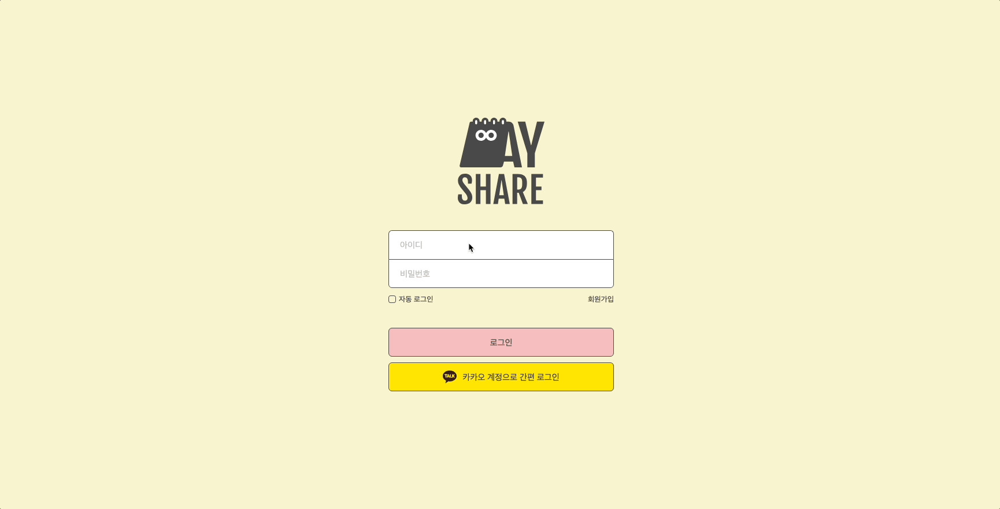
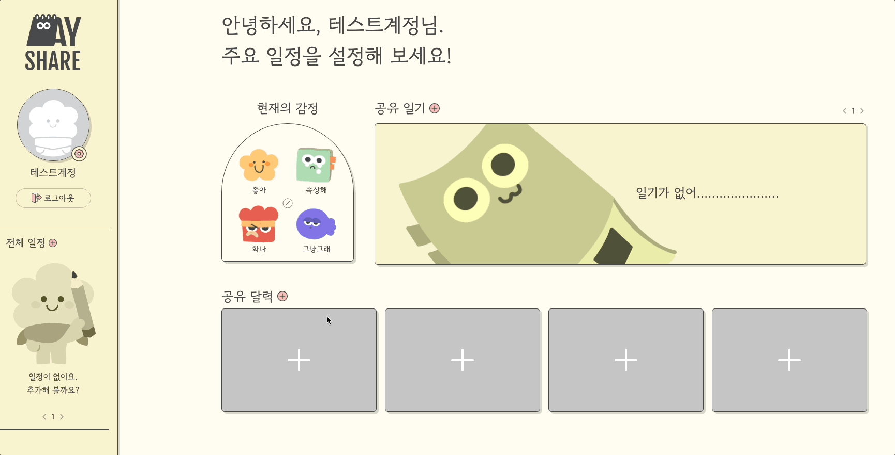
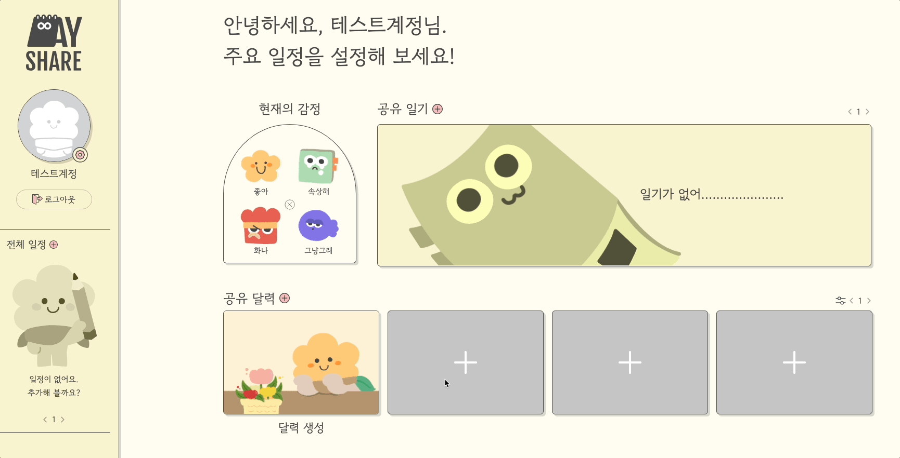
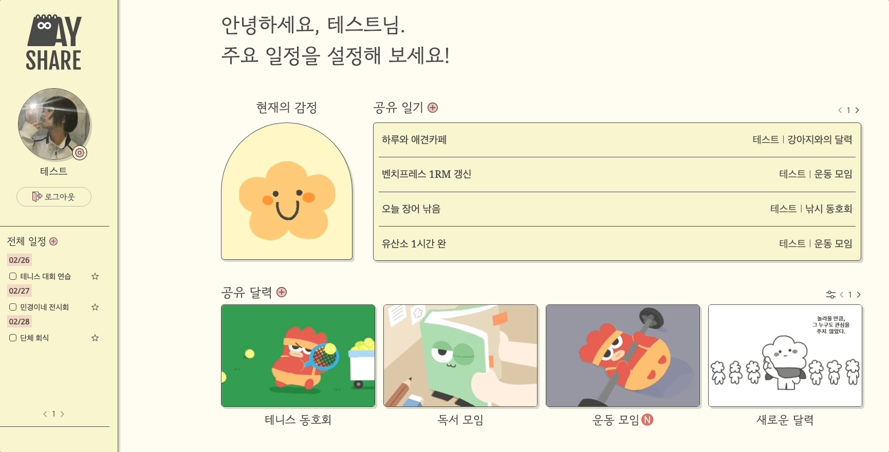
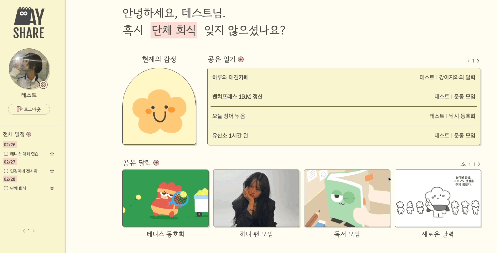
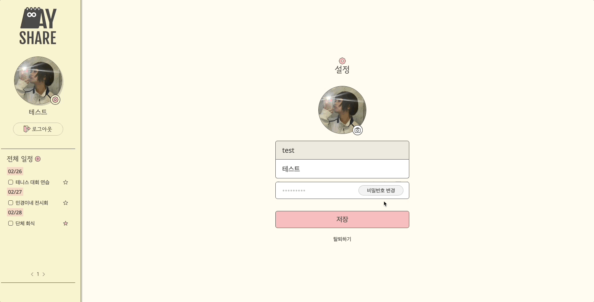
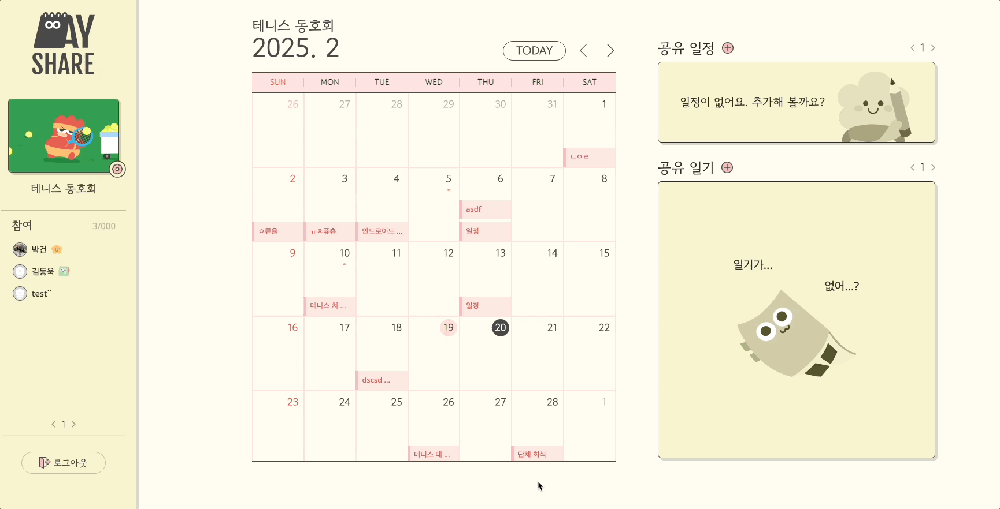
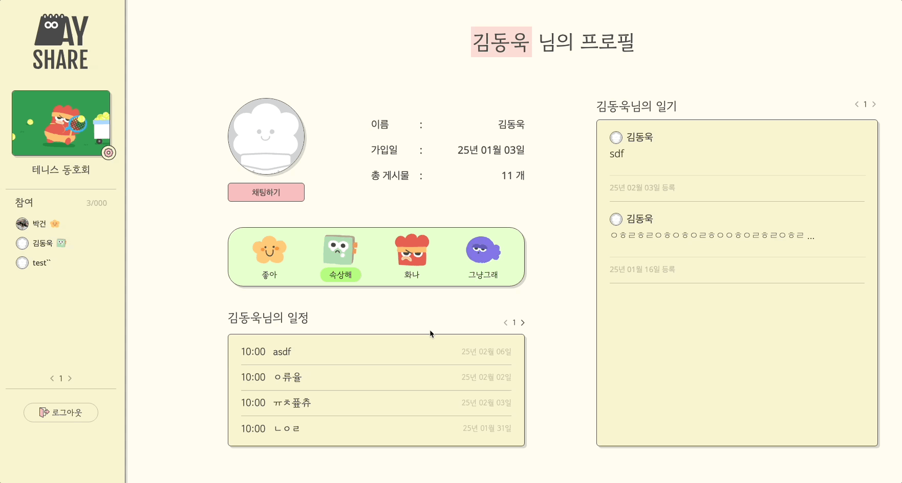
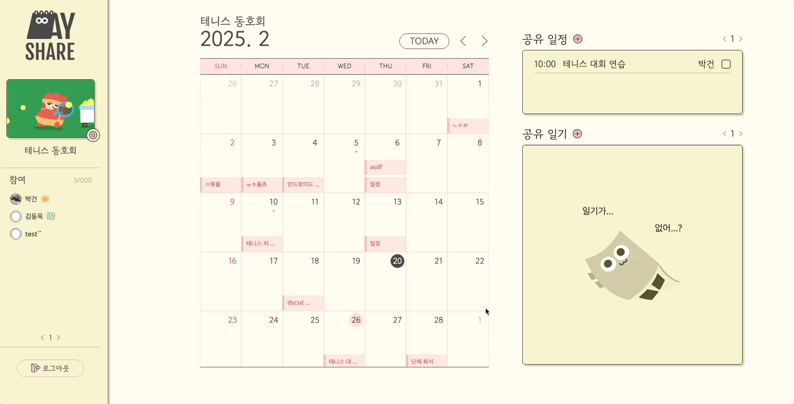
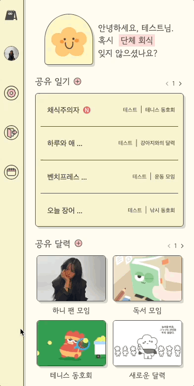

<div align="center">
  <a href="https://day-share.vercel.app/">
    
    <br />
    <a display="block" href="https://day-share.vercel.app/">DayShare 웹으로 이동</a>
  </a>
  <br />
  <br />
  <p>연인, 동호회, 육아 등 다양한 관계 속에서 함께 일기를 공유할 수 있는 플랫폼을 구축하는 개인 프로젝트 </p> 
</div>

---

## 📚 목차

- [미리보기](#-미리보기)
- [기술스택](#기술스택)

---

<br />

## 📸 미리보기

### 🔐 로그인 시스템

- **JWT 토큰 검증**: NextAuth JWT 콜백을 활용한 클라이언트 측 토큰 상태 관리
- **보안 강화**: RTR(Refresh Token Rotation) 적용으로 액세스 토큰 유출 위험 감소
- 관련 이슈: [#6](https://github.com/GEON1999/Day_Share_renew/issues/6) | [#3](https://github.com/GEON1999/Day_Share_renew/issues/3)



---

### 🗓️ 메인 페이지

#### 달력 관리

```javascript
// 모달 통합 관리 시스템
const ModalContainer = ({
  setIsOpen,
  initialModal = ModalType.ADD_CALENDAR,
}: ModalContainerProps) => {
  const [currentModal, setCurrentModal] = useState(initialModal);

  const renderModal = () => {
    switch (currentModal) {
      case ModalType.ADD_CALENDAR:
        return <AddCalendarModal setIsOpen={setIsOpen} />;
      case ModalType.CREATE_CONTENT_HOME:
        return <CreateContentHome setIsOpen={setIsOpen} />;
      default:
        return null;
    }
  };

  return (
    <ModalWrapper isOpen={true} setIsOpen={setIsOpen}>
      {renderModal()}
    </ModalWrapper>
  );
};
```




#### 인터랙티브 기능

- **즐겨찾기**: 실시간 refetching으로 상태 동기화
- **드래그 앤 드롭**: react-dnd 라이브러리 구현
- **이미지 편집**: react-image-crop 통합





---

### 📖 달력 페이지

#### AI 통합 일기 시스템

- **자동 댓글 생성**: OpenAI API 기반 감정 분석 및 상황에 맞는 답변 제공
- **안정성 우선**: deepseek 대비 안정적인 OpenAI API 채택
- **일기 생성 프로세스**

  1. **권한 검증 단계**

     - `CalendarPermission` 테이블에서 사용자의 캘린더 접근 권한 확인

  2. **다이어리 저장 처리**

     ```python
     db_diary = Diary(
         title=diary.title,
         content=diary.content,
         date=date,
         img=diary.img,
         userId=current_user,
         calendarId=calendar_id
     )
     db.add(db_diary)
     db.commit()
     ```

  3. **백그라운드 작업 처리**

     - 사용자 응답 지연 방지를 위한 비동기 처리
     - AI 댓글 생성 및 FCM알림 발송 작업을 큐에 추가

     ```python
        DiaryService._enqueue_background_tasks(background_tasks, calendar_id, db_diary)
        DiaryService._process_notifications(background_tasks, db, calendar_id, current_user, db_diary)
     ```

  4. **예외 처리 메커니즘**
     - 예외 발생 시 로그 기록 및 에러 반환
     ```python
        except IntegrityError as e:
            logger.error(f"데이터 무결성 오류: {str(e)}")
            raise HTTPException(status_code=400, detail="잘못된 데이터 형식입니다.")

        except SQLAlchemyError as e:
            logger.error(f"데이터베이스 오류: {str(e)}")
            raise HTTPException(status_code=503, detail="일시적인 시스템 오류가 발생했습니다.")

        except HTTPException:
            raise  # 이미 처리된 HTTP 예외는 상위로 전파

        except Exception as e:
            logger.critical(f"예상치 못한 오류: {str(e)}", exc_info=True)
            raise HTTPException(status_code=500, detail="서버 내부 오류가 발생했습니다.")
     ```



#### 실시간 채팅

- **WebSocket 통신**: FastAPI WebSocket 기반 실시간 채팅 구현
- **보안 통신**: Let's Encrypt SSL 인증서 적용으로 HTTPS 프로토콜 강제화



#### 모달관리

- **상태 제어**: 전역 스토어(zustand)를 통한 모달 상태 제어



---

### 📱 반응형 레이아웃

```css
/* Tailwind 기반 반응형 처리 */
.main_container {
  @apply lg:w-[1270px] w-[300px];
}

@media (min-width: 1024px) {
  .crop-max-size {
    max-width: 500px !important;
    max-height: 500px !important;
  }
}
```

- **모바일 우선 전략**: 390px ~ 1920px 대응
- **미디어 쿼리**: Tailwind 미처리 영역 추가 최적화



---

<a id="기술스택"></a>
## 🛠️ 기술 스택

### 프론트엔드

- **프레임워크**: Next.js 14
- **스타일링**: Tailwind CSS
- **상태 관리**: Zustand
- **폼 처리**: react-hook-form
- **UI 라이브러리**: react-dnd, react-image-crop

### 백엔드

- **인프라**: AWS (EC2, RDS)
- **API 서버**: FastAPI
- **인증**: NextAuth
