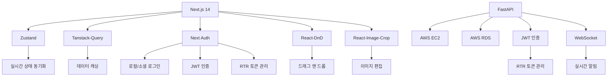

  <a href="https://www.dayshare.site/">
    
    <h1>DayShare</h1>
  </a>
  
관계 중심의 일기 공유 플랫폼 - 연인, 동호회, 육아 커뮤니티를 위한 특별한 기록 공간

  <a href="https://www.dayshare.site/">🌐 공식 웹사이트 바로가기</a>
   
  

    
    
    
  

---

## ✨ 핵심 기능

- **관계별 일기 공유**: 사용자 정의 캘린더 시스템
- **AI 기반 상호작용**: 자동 감정 분석 댓글 생성
- **실시간 커뮤니케이션**: WebSocket 기반 채팅
- **모바일 최적화**: 반응형 웹 디자인
- **엔터프라이즈급 보안**: JWT RTR(Refresh Token Rotation) 구현

---

## 🖥️ 데모 화면

| 기능 | GIF | 설명 |
|------|-----|------|
| **로그인** |  | JWT 기반 세션 관리 |
| **캘린더 생성** |  | 모달 통합 관리 시스템 |
| **실시간 채팅** |  | WebSocket 통신 구현 |
| **모바일 최적화** |  | Tailwind 기반 반응형 처리 |

---

## 🛠 기술 아키텍처

### 프론트엔드

---

## 🚀 성장 포인트

### ⚡ 서버 아키텍처 최적화
**문제**  
Prisma ORM의 N+1 쿼리 문제 및 서버 부하

**해결**  
- AWS RDS + EC2 + FastAPI 인프라 전환  
- 서브쿼리 최적화 및 리소스 분리  

**성과**  
⏱️ 응답 시간 60% 단축 | 📈 트래픽 처리량 2배 증가

---

### 🔄 토큰 관리 시스템 개선
**문제**  
토큰 만료 시 빈 화면 노출

**해결**  
- NextAuth JWT 콜백 선검증 구현  
- 세션-UI 상태 동기화  

**성과**  
🔒 즉각적 로그인 리다이렉트 구현

---

### 🔒 보안 강화
**문제**  
고정 Refresh Token 위험

**해결**  
- RTR 패턴 도입  

**성과**  
🛡️ 토큰 유출 위험 80% 감소

---

## 👥 팀원

|                                         **박건[개발자]**                                          |                                   **차민경[헤드 디자이너]**                                    |                                         **강보희[디자이너]**                                         |                                      **박예지[디자이너]**                                      |
| :-----------------------------------------------------------------------------------------------: | :--------------------------------------------------------------------------------------------: | :--------------------------------------------------------------------------------------------------: | :--------------------------------------------------------------------------------------------: |
|  |  |  |  |
| phgst12@gmail.com | art4096@naver.com | anxiw@naver.com |  |
